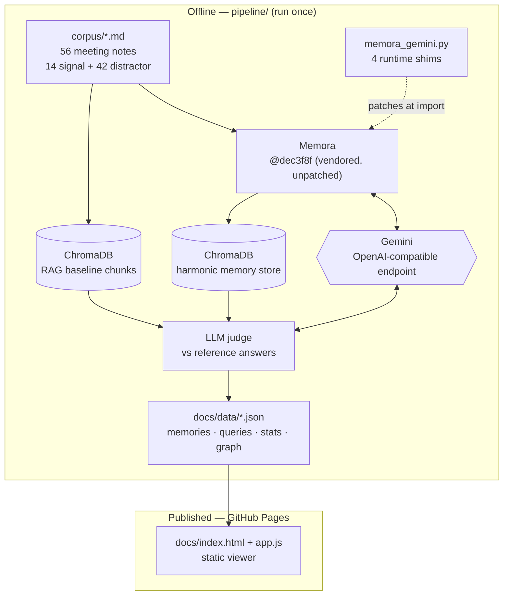

# Architecture — Memory X-ray (Memora account intelligence)

## Overview

A precomputed experiment plus a static viewer. All inference happens offline in
`pipeline/run_build.py`, which ingests a corpus of meeting notes with
[Memora](https://github.com/microsoft/Memora), runs the same questions through three
retrieval conditions, grades the answers, and writes the results to `docs/data/*.json`.
The published page is a plain HTML/CSS/JS viewer over those files — no API keys, no
backend, no inference at page load.

This split is deliberate. Memora needs Python, a vector store, and an LLM provider; none
of that belongs in a public demo page. Precomputing keeps the live artifact free to host
on GitHub Pages, permanently reproducible, and impossible to run up a bill.

## System diagram

## Components

| Component | Responsibility | Tech |
|---|---|---|
| `pipeline/build_corpus.py` | Authors the 14 hand-written account notes and the ground-truth question set | Python |
| `pipeline/build_distractors.py` | Generates 42 templated notes across 6 competing accounts so retrieval is non-trivial | Python |
| `pipeline/memora_gemini.py` | Four runtime shims that let unmodified Memora run on Gemini | Python monkeypatch |
| `pipeline/run_build.py` | Ingest, three-condition retrieval, answering, LLM-judge grading, JSON export | Memora, ChromaDB, OpenAI SDK |
| `pipeline/vendor/Memora` | Upstream Memora, pinned at commit `dec3f8f`, never edited | Git clone |
| `docs/` | Static viewer: scoreboard, token comparison, per-question X-ray, memory browser | HTML/CSS/vanilla JS |

## Data flow

1. **Corpus.** 56 markdown notes. Fourteen are hand-written for the account under test
   (Northwind Retail Group) and contain deliberately evolving facts — the budget changes
   three times, go-live twice, signoff ownership changes and changes back. Forty-two are
   templated notes for six other accounts that discuss the same things in the same
   vocabulary with different values; their only job is to compete for retrieval slots.

2. **Ingest.** Each note goes to `MemoraClient.add(type="doc")`. Memora calls the LLM to
   split it into memory entries, and for each entry produces a *primary abstraction* (a
   short phrase — the only thing embedded), the *memory value* (the full detail, stored
   unsummarized), and *cue anchors* (alternate retrieval handles). Embeddings go to
   ChromaDB.

3. **Baseline.** The same notes are split into ~700-character chunks, embedded with the
   *same* embedding model, and stored in a separate ChromaDB collection. This is a
   conventional RAG setup and the honest comparison point.

4. **Query.** Six questions run under three conditions:
   - `memora` — `advance_query(query_type="prompt")`, the policy-guided retriever that
     traverses cue anchors rather than relying on vector similarity alone
   - `rag` — top-k cosine similarity over the chunk collection
   - `full` — every note concatenated, no retrieval (the correctness ceiling)

5. **Answer and grade.** All three conditions use an identical answering prompt and model;
   only the retrieved context differs. An LLM judge grades each answer against a written
   reference, with the explicit instruction that stating a superseded value as current is
   a failure.

6. **Export.** Memories, cue graph, per-query traces, and aggregate stats are written as
   JSON to `docs/data/`.

## Deployment

GitHub Pages, serving the `docs/` folder directly from the `main` branch (Settings →
Pages → Source: *Deploy from a branch* → `main` / `/docs`). A push to `main` is the whole
deploy: there is no build step, bundler, dependency install, or CI workflow, because the
site is hand-written HTML/CSS/JS over precomputed JSON. `docs/.nojekyll` stops Jekyll from
reprocessing it.

An Actions-based deploy would work equally well, but buys nothing here — with no build
step the artifact is identical to the source folder.

Rerunning the experiment is a manual, local step (`run_build.py` with a `GEMINI_API_KEY`);
nothing in the deploy path calls a model, so no secrets are needed to publish.

## Tech choices & rationale

**Why Memora, and what it took.** Memora is the technology under trial: the ICML 2026
harmonic memory representation from Microsoft Research. It genuinely does the memory work
here — the abstractions, cue anchors, consolidation and retrieval policy are all Memora's,
called through its public `MemoraClient` API.

Getting there took four shims, all in `pipeline/memora_gemini.py`, none of which touch
Memora's source:

1. **Stub unused heavy imports.** `memora/utils/llm.py` and
   `memora/retriever/local_policy_retriever.py` import `torch`, `transformers` and `peft`
   at module top level. Those are only used for local HuggingFace checkpoints and GRPO
   training — dead weight on the hosted-API path, but a hard `ImportError` without them.
2. **Set a `base_url`.** Both `get_openai_chat_completion_client` and
   `get_openai_embedding_client` construct `OpenAI(api_key=...)` with no base URL, so
   there is no supported way to point Memora at a non-OpenAI provider.
3. **Force hosted-API routing.** `ChatCompletionModel._determine_model_type` decides
   local-vs-hosted by substring-matching `gpt`/`o1`/`o3`. A model named `gemini-*` falls
   through to the HuggingFace branch and Memora tries to download a checkpoint.
4. **Drop `seed`.** Memora always sends `seed=`; Gemini's compatibility layer rejects
   unknown fields with a 400 rather than ignoring them.

Two upstream gaps are worth naming separately, because they are packaging bugs rather than
provider assumptions: the repo has **no `pyproject.toml` or `setup.py`**, so the README's
`pip install -e .` fails outright, and `requirements.txt` is the union of runtime and
research dependencies (torch, transformers, bitsandbytes, peft, mem0ai) rather than what
the library actually needs to run.

**Why Gemini.** Memora needs both chat and embeddings from an OpenAI-compatible endpoint.
Gemini provides both (`gemini-3.6-flash`, `gemini-embedding-001`) and supports the
structured-output call Memora depends on (`beta.chat.completions.parse` with a Pydantic
schema), which is the non-obvious requirement — a provider without it cannot run Memora's
extraction step at all. Anthropic models were not an option here: Claude has no
OpenAI-compatible embeddings endpoint, and Memora needs one.

**Why precomputed and static.** See Overview. The alternative — a live backend on AWS —
would have added a Lambda, a vector store to keep warm, and a key to rotate, in exchange
for letting visitors type their own questions against a fictional corpus. Not worth it.

**Why vanilla JS.** The page renders four JSON files into cards, bars and a table. A
framework would be more code, not less.

## Known limitations / tradeoffs

- **The corpus is fictional and small.** 56 notes is far below the scale Memora reports on
  (LoCoMo, LongMemEval). Results here indicate direction, not a benchmark reproduction.
- **The first run proved nothing.** With only the 14 account notes (2,730 tokens), all
  three conditions — including no retrieval at all — scored 6/6. That result is preserved
  in `pipeline/result_small_corpus.json`. The distractor accounts exist specifically
  because the original design could not discriminate.
- **Token counts use tiktoken `cl100k_base`**, an OpenAI tokenizer. Gemini's differs, so
  the numbers are a consistent relative comparison, not exact billing counts.
- **The judge is an LLM**, grading against written reference answers. Reference answers and
  verdicts are both published in `docs/data/queries.json` so any grade can be checked by
  hand.
- **One retrieval strategy tested.** Memora's GRPO-trained policy retriever is untested
  here — it needs a GPU and a training run, which is out of scope for a demo.
- **Memora is a research code drop.** A single commit, no releases, no PyPI package. The
  shims in this repo are pinned to commit `dec3f8f` and may not hold against future
  versions.
